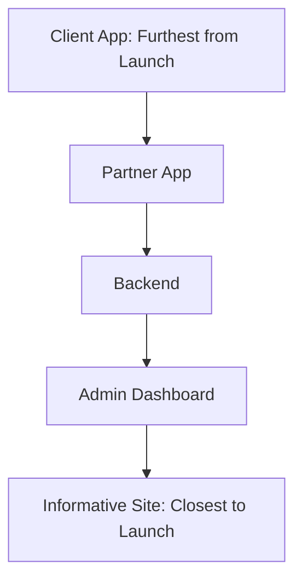

# Local PCO Home Services (Local PCO PCO) — Pre-Launch Audit Report

This report summarizes the full-stack pre-launch audit of the Local PCO Home Services repository. It spans the 5 key modules: **Backend**, **Admin Dashboard**, **Informative Site**, **Partner App**, and **Client App**.

---

## 1. Launch Blocker List (Must Fix Before Going Live)
These issues expose keys/secrets, risk payment/wallet integrity, or outright prevent core features from working.

### Secrets & Environment Hygiene
1. **Committed Environment Files in Git History**
   - **File:** [backend/.env](backend/.env) and [partner/Local-Pco-Pr/.env](partner/Local-Pco-Pr/.env)
   - **Severity:** Blocker
   - **Description:** `.env` files are tracked in the Git repository because the `.gitignore` files contain only `node_modules`. This leaks the MongoDB Atlas URL (with credentials), the JWT secret, and Cloudinary keys in Git logs.
   - **Remediation:** Remove the `.env` files from Git tracking (`git rm --cached`), add them to the `.gitignore` files, and rotate the compromised secrets (especially Atlas and Cloudinary keys).

2. **Hardcoded Cloudinary Secrets in Mobile Build Configuration**
   - **File:** [partner/Local-Pco-Pr/eas.json#L27-L29](partner/Local-Pco-Pr/eas.json#L27-L29) and [eas.json#L39-L41](partner/Local-Pco-Pr/eas.json#L39-L41)
   - **Severity:** Blocker
   - **Description:** EAS build config files hardcode the Cloudinary API Key, Secret, and Cloud Name in the environment sections of `production` and `production-aab` profiles.
   - **Remediation:** Remove these secrets from the JSON configuration and load them using EAS Secret variables during execution.

3. **Weak Seed Passwords in Production Scripts**
   - **File:** [backend/seedAdmin.js#L28](file:///d:/Groww%20You/Local PCO%20Home%20Services/localpco-pco/backend/seedAdmin.js#L28) and [backend/seedVerifier.js#L27](file:///d:/Groww%20You/Local PCO%20Home%20Services/localpco-pco/backend/seedVerifier.js#L27)
   - **Severity:** Blocker
   - **Description:** Default password is set to a weak `'asdf1234'` for both seed Admin and seed Verifier users.
   - **Remediation:** Modify scripts to consume input arguments or environment variables (`process.env.SEED_ADMIN_PASSWORD`).

### Wallet & Payment Integrity
4. **Complete Absence of Transaction Creation in Wallet Module**
   - **File:** [backend/src/controllers/walletController.js](file:///d:/Groww%20You/Local PCO%20Home%20Services/localpco-pco/backend/src/controllers/walletController.js) and [backend/src/controllers/jobController.js](file:///d:/Groww%20You/Local PCO%20Home%20Services/localpco-pco/backend/src/controllers/jobController.js)
   - **Severity:** Blocker
   - **Description:** There is no database-level creation of transaction documents anywhere. When a partner finishes a job, no credit transaction is made, causing partner wallet balances to remain at zero.
   - **Remediation:** Implement transaction creation (`Transaction.create`) in the job completion endpoint of `jobController.js` inside a Mongoose transaction block.

5. **Hardcoded Zero Balances in Admin Wallet Endpoint**
   - **File:** [backend/src/controllers/adminController.js#L295-L296](file:///d:/Groww%20You/Local PCO%20Home%20Services/localpco-pco/backend/src/controllers/adminController.js#L295-L296)
   - **Severity:** Blocker
   - **Description:** The admin API endpoint for fetching wallets maps partners to a placeholder object with `balance: 0` and `pendingPayout: 0`.
   - **Remediation:** Replace placeholder maps with aggregation queries over the transaction log or query the partner's balance field.

6. **Commented-Out Service Base Price Calculation**
   - **File:** [backend/src/controllers/requestController.js#L72](file:///d:/Groww%20You/Local PCO%20Home%20Services/localpco-pco/backend/src/controllers/requestController.js#L72)
   - **Severity:** Blocker
   - **Description:** The line resolving `estimatedCharges = category.basePrice || 0` is commented out. Because of this, every created request gets booked with an estimated charge of `0`, leading to zero-dollar transaction completions.
   - **Remediation:** Uncomment this logic and properly fetch base prices from the database.

### Mobile & App Flow
7. **Active Request Never Fetched on Client App Launch**
   - **File:** [client/Local-Pco-Client/src/store/requestSlice.ts#L109](file:///d:/Groww%20You/Local PCO%20Home%20Services/localpco-pco/client/Local-Pco-Client/src/store/requestSlice.ts#L109)
   - **Severity:** Blocker
   - **Description:** The `fetchActiveRequest` thunk is defined but never dispatched in any React Native screens. Users who relaunch the app mid-job will see a blank dashboard with "No Active Request".
   - **Remediation:** Dispatch `fetchActiveRequest` inside the root navigation/auth checker or inside the dashboard's focus effect.

8. **Lack of Push Notification / Real-Time Syncing on Mobile Apps**
   - **File:** [client/Local-Pco-Client/App.tsx](file:///d:/Groww%20You/Local PCO%20Home%20Services/localpco-pco/client/Local-Pco-Client/App.tsx) and [partner/Local-Pco-Pr/App.tsx](file:///d:/Groww%20You/Local PCO%20Home%20Services/localpco-pco/partner/Local-Pco-Pr/App.tsx)
   - **Severity:** Blocker
   - **Description:** Firebase Messaging dependencies are unused, and no sockets or polling mechanisms exist. Partners and clients will not see job status updates (e.g. accepted, in progress, completed) unless they manually trigger pull-to-refresh.
   - **Remediation:** Implement standard WebSockets (Socket.io) or interval-based polling (e.g., every 10 seconds) on active screens, and initialize the Firebase push notification system in code.

9. **Incomplete Authentication Route on Backend**
   - **File:** [backend/src/routes/authRoutes.js](file:///d:/Groww%20You/Local PCO%20Home%20Services/localpco-pco/backend/src/routes/authRoutes.js) vs [client/.../services/api.ts#L73](file:///d:/Groww%20You/Local PCO%20Home%20Services/localpco-pco/client/Local-Pco-Client/src/services/api.ts#L73)
   - **Severity:** Blocker
   - **Description:** Axios interceptors on mobile call `/auth/refresh` on getting a 401 response, but the backend lacks `/refresh` route mounts. This returns a 404, logging users out immediately on token expiration.
   - **Remediation:** Mount a `/refresh` endpoint in `authRoutes.js` and implement JWT refresh logic in `authController.js`.

---

## 2. Fast-Follow List (Fix Within 2 Weeks of Launch)
High-risk items that could impact system availability, lead to process crashes, or degrade user security.

1. **Express Server Process Crash on Authentication Middleware Errors**
   - **File:** [backend/src/middleware/authMiddleware.js#L30-L32](file:///d:/Groww%20You/Local PCO%20Home%20Services/localpco-pco/backend/src/middleware/authMiddleware.js#L30-L32) and [authMiddleware.js#L64-L66](file:///d:/Groww%20You/Local PCO%20Home%20Services/localpco-pco/backend/src/middleware/authMiddleware.js#L64-L66)
   - **Severity:** High
   - **Description:** Middleware functions lack early returns inside catch blocks and `!token` checks. A request with a missing or malformed header triggers headers-sent errors and crashes the Express backend.
   - **Remediation:** Add explicit `return` statements in the middleware `catch` blocks and `!token` checks.

2. **[RESOLVED] Insecure Storage of JWT on Mobile Devices**
   - **Status:** Resolved (Implemented `expo-secure-store` in the partner application to safely encrypt credentials and access keys instead of plain `AsyncStorage`).

3. **Status Enum Mismatches (Database vs Code Drift)**
   - **File:** [backend/src/models/ServiceRequest.js#L28](file:///d:/Groww%20You/Local PCO%20Home%20Services/localpco-pco/backend/src/models/ServiceRequest.js#L28)
   - **Severity:** High
   - **Description:** The Mongoose schema restricts status to `['pending', 'completed']`, while mobile apps, admin views, and controllers reference states like `assigned`, `in_progress`, or `paid`. Attempting to save these statuses causes database validation errors.
   - **Remediation:** Align enums in `ServiceRequest.js` to encompass `['pending', 'assigned', 'in_progress', 'completed', 'paid', 'cancelled']`.

4. **Lack of Status-Transition Safeguards**
   - **File:** [backend/src/controllers/jobController.js#L110](file:///d:/Groww%20You/Local PCO%20Home%20Services/localpco-pco/backend/src/controllers/jobController.js#L110)
   - **Severity:** High
   - **Description:** The status update endpoint assigns any incoming body status directly to Mongoose without checking valid state machine routes (e.g. allowing going backwards from `completed` to `pending`).
   - **Remediation:** Implement validation helper checking `currentStatus` against permitted state-machine actions.

5. **Inefficient In-Memory Balance Calculations**
   - **File:** [backend/src/controllers/walletController.js#L12-L17](file:///d:/Groww%20You/Local PCO%20Home%20Services/localpco-pco/backend/src/controllers/walletController.js#L12-L17)
   - **Severity:** High
   - **Description:** Balance is calculated on the server by loading and reducing all transactions for a partner. This will lead to slow response times and memory starvation as the database grows.
   - **Remediation:** Add a cached `balance` property to the `Partner` model and update it atomically whenever a transaction document is successfully created.

6. **Unconfigured Maps API keys**
   - **File:** [client/Local-Pco-Client/app.json#L23](file:///d:/Groww%20You/Local PCO%20Home%20Services/localpco-pco/client/Local-Pco-Client/app.json#L23) and [app.json#L35](file:///d:/Groww%20You/Local PCO%20Home%20Services/localpco-pco/client/Local-Pco-Client/app.json#L35)
   - **Severity:** High
   - **Description:** Client app hardcodes `"YOUR_GOOGLE_MAPS_API_KEY"` which blocks mapping rendering.
   - **Remediation:** Insert real API credentials or configure EAS environment hooks to build with maps enabled.

7. **Mocked Geocoding and Place Search Endpoints**
   - **File:** [backend/src/controllers/locationController.js#L74-L98](file:///d:/Groww%20You/Local PCO%20Home%20Services/localpco-pco/backend/src/controllers/locationController.js#L74-L98)
   - **Severity:** High
   - **Description:** `reverseGeocode` and `searchPlaces` return static mocked locations in New Delhi, making address lookup fail for any users outside that area.
   - **Remediation:** Integrate Google Maps Geocoding API or alternative geocoder.

8. **Serverless Cold-Start Database Checks**
   - **File:** [backend/app.js#L31-L40](file:///d:/Groww%20You/Local PCO%20Home%20Services/localpco-pco/backend/app.js#L31-L40)
   - **Severity:** High
   - **Description:** ReadyState check bypasses database connection flow if the status is `2` (connecting), causing DB operations that execute before the connection finishes to fail.
   - **Remediation:** Await a promise resolution confirming connection status is `1` (connected).

---

## 3. Tech-Debt Backlog (Defer, but Document)
Non-blocking architecture and cleanup items.

1. **API Host Inconsistencies**
   - **File:** [client/.../config/index.ts#L13](file:///d:/Groww%20You/Local PCO%20Home%20Services/localpco-pco/client/Local-Pco-Client/src/config/index.ts#L13) vs [partner/.../eas.json#L25](file:///d:/Groww%20You/Local PCO%20Home%20Services/localpco-pco/partner/Local-Pco-Pr/eas.json#L25) vs Backend
   - **Severity:** Medium
   - **Description:** Client code hardcodes Render URL (`https://localpco-pco.onrender.com`), while the deployment target is Vercel. 
   - **Remediation:** Unify backend deployment targets and point both mobile apps to the correct Vercel endpoint.

2. **Missing Database Indexes**
   - **File:** [backend/src/models/Transaction.js](file:///d:/Groww%20You/Local PCO%20Home%20Services/localpco-pco/backend/src/models/Transaction.js) and [backend/src/models/ServiceRequest.js](file:///d:/Groww%20You/Local PCO%20Home%20Services/localpco-pco/backend/src/models/ServiceRequest.js)
   - **Severity:** Medium
   - **Description:** Missing indexes on foreign reference fields (`clientId`, `partnerId`, `jobId`) lead to database collection scans as history sizes swell.
   - **Remediation:** Add `{ index: true }` property mappings for fields referenced in aggregation and find queries.

3. **Missing Role Checks in Admin Dashboard Route Guards**
   - **File:** [admin/src/routes/AppRoutes.tsx](file:///d:/Groww%20You/Local PCO%20Home%20Services/localpco-pco/admin/src/routes/AppRoutes.tsx)
   - **Severity:** Medium
   - **Description:** `ProtectedRoute` lets any logged-in user with a valid token load admin page components, which allows `verifier` role users to navigate to admin paths, though backend calls will still fail.
   - **Remediation:** Pass allowed roles array into `ProtectedRoute` component wrappers.

4. **Massive Code Duplication**
   - **Severity:** Medium
   - **Description:** Mobile apps copy Axios API clients, configurations, UI elements, and validators.
   - **Remediation:** Refactor workspace structure into a monorepo (using Yarn/NPM workspaces or Turborepo) with a shared `common` folder.

5. **[RESOLVED] Informative Site SEO Deficiency**
   - **Status:** Resolved (Configured standard description meta-tags, generated robots.txt and sitemap.xml files under informative/public, and unified spelling to 'Local PCO').

6. **Incompatible Expo Location Library in Client App**
   - **File:** [client/Local-Pco-Client/package.json#L24](file:///d:/Groww%20You/Local PCO%20Home%20Services/localpco-pco/client/Local-Pco-Client/package.json#L24)
   - **Severity:** Medium
   - **Description:** Client app maps `expo-location` to `~18.1.5` instead of `~19.0.8` recommended for Expo 54. This will cause compilation issues or runtime malfunctions in location detection.
   - **Remediation:** Run `npx expo install expo-location --fix` in the client directory.

7. **[RESOLVED] Absent Test Suites**
   - **Status:** Resolved (Configured Jest test runner and automated backend test cases for services, models, and controllers).

---

## 4. Module Launch Readiness Ranking
Here is the ranking of the 5 modules, from furthest-from-ready to closest-to-ready.

### Furthest from Launch: Client Mobile App
The **Client Mobile App** is the furthest from launch-ready due to three structural flaws:
1. **Broken Active Job Lifecycle:** It defines the `fetchActiveRequest` thunk but never dispatches it. If a customer exits the app while a booking is active and re-opens it, the app starts with a null active request state, making tracking and completion feedback impossible.
2. **Missing Real-Time Sync:** There are no Socket connections or periodic polling methods to track when a service provider updates job status.
3. **App Crash Risk:** It references `@react-native-firebase/app` and `@react-native-firebase/messaging` libraries in its dependencies, but provides no config plugins or `google-services.json` credentials. This causes native crashes on android/iOS builds. Additionally, the `expo-location` package version drifts from Expo SDK 54 requirements, risking compilation failure.
